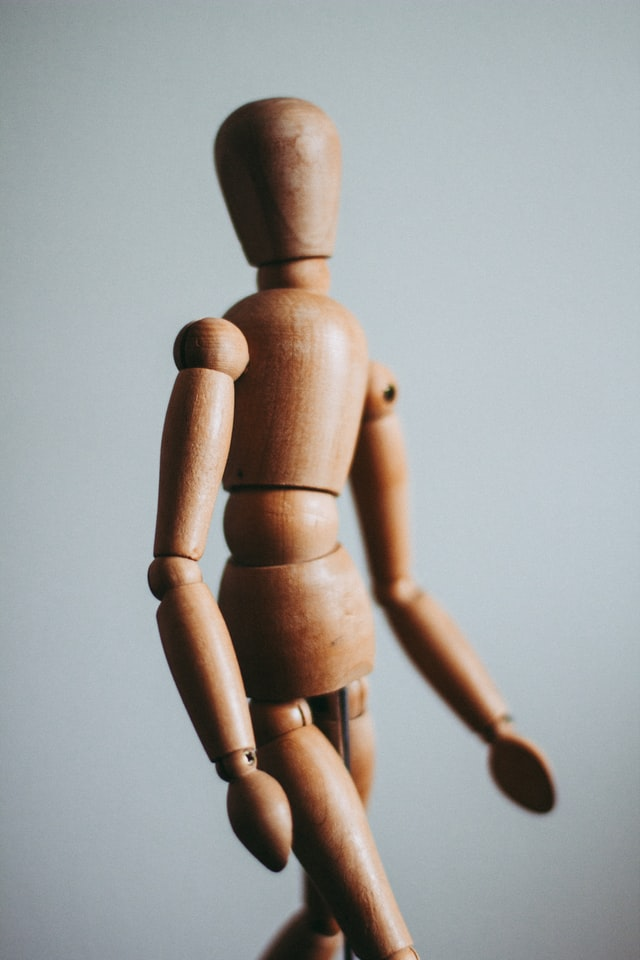

# Jino Rohit
*An Aspiring Machine Learning Engineer | 2X Kaggle Expert*

# Education
* Bachelor of Technology (Computer Science and Engineering), *KCT*, 2019-2023

# [Project 1: Behavioral Cloning for Self-Driving Cars](https://github.com/JINO-ROHIT/Behavioral-Cloning-for-Driverless-Cars)

Photo by <a href="https://unsplash.com/@dhivakrishna?utm_source=unsplash&utm_medium=referral&utm_content=creditCopyText">Dhiva Krishna</a> on <a href="https://unsplash.com/s/photos/cars?utm_source=unsplash&utm_medium=referral&utm_content=creditCopyText">Unsplash</a>
  

This project deals with teaching the model how to mimick the driver's performance
* **Libraries used:** Numpy, Sklearn, TensorFlow, Keras
* **Input:** Images of the dimension 160 x 320 x 3
* **Output:** Completes one lap on Carla Simulator

# [Project 2: Language Translator from English to Arabic](https://github.com/JINO-ROHIT/Language_Translation)

Photo by <a href="https://unsplash.com/@syhussaini?utm_source=unsplash&utm_medium=referral&utm_content=creditCopyText">Syed Hussaini</a> on <a href="https://unsplash.com/s/photos/arabic?utm_source=unsplash&utm_medium=referral&utm_content=creditCopyText">Unsplash</a>

This project makes use of ***natural language processing*** to translate English phrases to Arabic phrases.
* **Libraries used:** Numpy, Pandas, Keras
* **Input:** English Phrases
* **Output:** Arabic Phrases

# [Project 3: Gesture Detection of Palm](https://github.com/JINO-ROHIT/Gesture-detection-of-palm-head)

Photo by <a href="https://unsplash.com/@kadh?utm_source=unsplash&utm_medium=referral&utm_content=creditCopyText">Kira auf der Heide</a> on <a href="https://unsplash.com/s/photos/gesture-detection?utm_source=unsplash&utm_medium=referral&utm_content=creditCopyText">Unsplash</a>

This project detects movements of your palm or your head using ***computer vision***. The program picks up anything it sees within the hsv range of human skin and does a tracking to record the movement.
* **Libraries used:** Cv2, Numpy, Time, Imutils, Pyautogui 
* **Output:** Palm/Head Tracking

# [Project 4: Face Comparison Using Mtcnn](https://github.com/JINO-ROHIT/Face-Comparison-using-MTCNN)

Photo by <a href="https://unsplash.com/@omarlopez1?utm_source=unsplash&utm_medium=referral&utm_content=creditCopyText">Omar Lopez</a> on <a href="https://unsplash.com/s/photos/two-faces?utm_source=unsplash&utm_medium=referral&utm_content=creditCopyText">Unsplash</a>

This project compares two images and evaluates them using hamming score depending on their closeness.
* **Libraries used:** Cv2, Numpy, PIL, Mtcnn
* **Input:** Two images
* **Output:** Result on how closely related they are

# [Project 5: Movie Recommendation System](https://github.com/JINO-ROHIT/SIMPLE-MOVIE-RECOMMENDATION-SYSTEM)

Photo by <a href="https://unsplash.com/@rswebsols?utm_source=unsplash&utm_medium=referral&utm_content=creditCopyText">Souvik Banerjee</a> on <a href="https://unsplash.com/s/photos/movies?utm_source=unsplash&utm_medium=referral&utm_content=creditCopyText">Unsplash</a>
  
This project recommends top 10 movies based on your likings by evaluating the sigmoid kernel.
* **Libraries used:** Pandas, Numpy, Sklearn
* **Input:** Movie name 
* **Output:** Top 10 related movies

# [Project 6: FIFA Players Analysis](https://github.com/JINO-ROHIT/FIFA-ANALYSIS-)

Photo by <a href="https://unsplash.com/@alexlanting?utm_source=unsplash&utm_medium=referral&utm_content=creditCopyText">Alex</a> on <a href="https://unsplash.com/s/photos/football?utm_source=unsplash&utm_medium=referral&utm_content=creditCopyText">Unsplash</a>

This is a detailed analysis of some of the popular football players who play at the International Stage.
* **Libraries used:** Pandas, Numpy, Matplotlib, Seaborn

# [Project 7: House Price Prediction](https://github.com/JINO-ROHIT/HOUSE-PREDICTION)

Photo by <a href="https://unsplash.com/@steve4c?utm_source=unsplash&utm_medium=referral&utm_content=creditCopyText">Stephan Bechert</a> on <a href="https://unsplash.com/s/photos/house?utm_source=unsplash&utm_medium=referral&utm_content=creditCopyText">Unsplash</a>

This project predicts the price for a given location around Bengaluru. 
* **Libraries used:** Pandas, Numpy, Matplotlib, Sklearn, Flask, AWS EC2 Instance
* **Input:** Location Name, SquareFeet, BHK, Bath
* **Output:** Estimated Price Range

